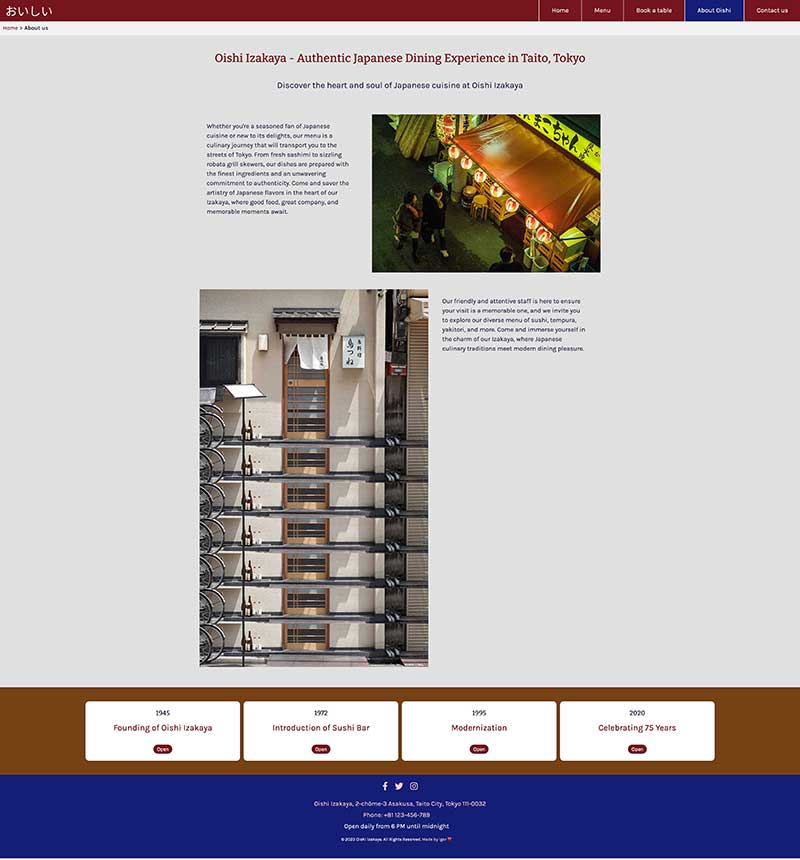
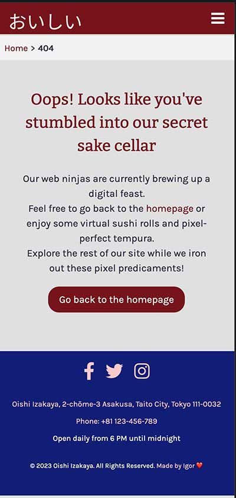

# Oishi Izayaka

Oishi Izakaya is not just a restaurant; it's an experience, a journey into the heart of Japanese cuisine and culture. 
Nestled at the intersection of tradition and innovation, our izakaya offers a delectable fusion of flavours that 
will transport your taste buds to the vibrant streets of Japan.

 

What's in Store:

- Menu: Explore our diverse menu, brimming with authentic Japanese dishes and creative twists. Whether you crave sushi, 
sashimi, tempura, or more, our menu caters to every palate. Find your favourite dishes and discover new culinary delights.

- Story: Behind every great establishment lies an inspiring narrative. Learn about the Oishi Izakaya story, 
our commitment to quality, and the passion that fuels our culinary journey. Uncover the traditions, inspirations, 
and values that shape our gastronomic identity.

- Reservations: Ready to embark on your own Oishi Izakaya adventure? Secure your table now! Make reservations 
effortlessly through our online booking system and guarantee a memorable dining experience with us.

Dive into our webpage to embark on a gastronomic voyage like no other. We look forward to sharing the flavours, culture, 
and the story of Japan with you at Oishi Izakaya.

Live webpage [here](https://igordinuzzi.github.io/oishizakaya/)

## Features

- Navigation with links to pages, responsive on all devices.
Navigation in a webpage is crucial for providing a user-friendly experience by enabling visitors to efficiently explore 
and access the site's content, ultimately improving user engagement and satisfaction. 
It helps users find information, products, or services, leading to increased usability and retention.
 
 
  
- Footer with social icons, link to map and direct link to Github.
At the bottom of the page, visitors will discover social media icons leading to the restaurant's Facebook, Twitter, 
and Instagram profiles, offering the latest updates and opportunities for interaction. Additionally, the footer features 
essential information, including the restaurant's address, opening hours, and contact phone number, 
making it convenient for planning a visit. It also serves as a valuable resource, confirming 
the copyright details that emphasize the distinctiveness and ownership of the content. Moreover, 
a direct link to their GitHub repository is provided, granting effortless access to the codebase 
for those interested in exploring further or collaborating with the establishment.   
  
  

- Favicon for easy recognition.
The favicon is important in a webpage as it provides a recognizable visual identity in browser tabs, 
enhancing brand visibility and user recognition, and it helps users quickly locate and return to the site.
  
  
- Landing page 
The landing page is structured with a two-column design, offering links to both the menu and reservation pages, 
as well as dedicated sections for client reviews.
    
    

- Menu page
On the menu page, users will have the capability to navigate through the menu by utilizing tabs for scrolling.
    
    

- Book a table page
The "Book a Table" page assists users in reserving a table, enabling them to select their preferred date and time.
    
    

- About Oishi
The "About Oishi Izakaya" page is dedicated to narrating the izakaya's story through a two-column layout, with 
a specific section highlighting the significant milestones and history of the restaurant.
    
    

- Contact
The contact page provides users with various options, including obtaining directions and a map to reach the restaurant, 
contacting them for inquiries, and displaying the restaurant's address via an embedded Google Map iframe.
    
    
  
 - 404 page - Custom 404 page and the auto-redirect feature to the homepage. The custom 404 page and auto-redirect
feature has been seamlessly integrated. This ensures that when a user encounters a 404 error, they will experience 
a smooth transition to the custom 404 page and subsequently be redirected to the homepage by a link. 
    
    

- Breadcrumbs - Breadcrumbs are important for website navigation because they provide a clear trail of links that show users their current location within a website's hierarchy. 
They enhance the user experience by helping visitors easily understand the site's structure, find their way back to previous pages, 
and navigate to higher-level categories or the homepage. This improves usability, reduces user frustration, and increases the overall effectiveness of a website.
      

- Menu tabs - JavaScript in a menu tab enhances website interactivity, provides smooth animations, and enables real-time content updates, improving the user experience. 
It allows for customization and responsiveness, ensuring a tailored and consistent navigation experience. Additionally, JavaScript can encourage user engagement, 
gather feedback, and enhance the aesthetics of menu tabs, contributing to a more dynamic and visually appealing website.
    
    

- Milestones - JavaScript in a milestone timeline enhances user interaction by enabling dynamic features like drag-and-drop functionality, 
and animated transitions, making it more engaging. It allows for real-time updates to the timeline, 
ensuring that users can see progress or changes as they occur, providing a more dynamic and informative experience. 
JavaScript also enables customization, enabling the timeline to align with specific design and functionality requirements, enhancing its utility.
    
     
  

## Existing Features and Features to Implement

**Existing features:**
- JavaScript functionality for the navigation burger menu.
- JavaScript functionality for bouncing calls to actions.
- JQuery functionality for changing the greeting in the hero image based on the user's timezone. 
- JavaScript functionality for menu tabs.
- JavaScript functionality for the milestone timeline.

## Technologies

The Oishi website utilizes the following technologies:

- Figma for design.
- FontAwesome for icons.
- CSS for styling.
- HTML for content.
- JavaScript
- JQuery
- Visual Studio Code for development.
- GitHub for version control.
- ChatGPT for content creation.

## Testing

The website has been thoroughly tested on various devices and browsers:

- Mobile (iPhone 14)
- Smaller laptop MacBook Air
- iMac

**Responsiveness:**

All pages were tested to ensure responsiveness on screen sizes from 320px and upwards as defined in WCAG 2.1 
Reflow criteria for responsive design on Chrome, Edge, Firefox, Safari and Opera browsers.

Steps to test:

- Open the browser and navigate to Oishi Izakaya
- Open the developer tools (right-click and inspect)
- Set to responsive and decrease width to 320px
- Set the zoom to 50%
- Click and drag the responsive window to the maximum width

Expected:

The website is responsive on all screen sizes and no images are pixelated or stretched. 
No horizontal scroll is present. No elements overlap.

Actual:

The website behaved as expected.

The website was also opened on the following devices and no responsive issues were seen:

- iPhone 14
- iPhone SE
- Samsung Galaxy Android S20 Android 11
- MacBook Air
- iMac 27''
- iMac 24''

**Accessibility:**

[Wave Accessibility](https://wave.webaim.org/) tool was used throughout the development 
and for final testing of the deployed website to check for any aid accessibility testing.

Testing was focused to ensure the following criteria were met:

- All forms have associated labels or aria-labels so that this is read out on a screen reader to users who tab to form inputs
- Color contrasts meet a minimum ratio as specified in WCAG 2.1 Contrast Guidelines
- Heading levels are not missed or skipped to ensure the importance of content is relayed correctly to the end user
- All content is contained within landmarks to ensure ease of use for assistive technology, allowing the user to navigate by page regions
- All not textual content had alternative text or titles so descriptions were read out to screen readers
- HTML page lang attribute has been set
- Aria properties have been implemented correctly
- WCAG 2.1 Coding best practices being followed

Manual tests were also performed to ensure the website was as accessible as possible and an accessibility issue was identified.

I've discovered several errors on the webpage, specifically related to headers and the iframe. 
I fixed these issues to enhance accessibility and ensure that all users can easily navigate 
and interact with the content, promoting a more inclusive and user-friendly experience.

**Browser Compatibility Checked:**

- Safari
- Firefox
- Google Chrome

**Functional Testing**

Navigation Links:

Testing was performed to ensure all navigation links on the respective pages, navigated 
to the correct pages as per design. This was done by clicking on the navigation links on each page.

| Navigation Link | Page to Load          |
| --------------- | ----------------------|
| Home            | index.html            |
| Menu            | menu.html             |
| Book a table    | reservation.html      |
| About           | about.html            |
| Contact         | contact.html          |
| 404             | 404.html              |

Links on all pages navigated to the correct pages as expected.

| Test Case                 | Description                                                       | Expected Result                                                                  |
|---------------------------|-------------------------------------------------------------------|----------------------------------------------------------------------------------|
| 1. Homepage               | Verify that the homepage loads successfully.                      | Page loads without errors.                                                       |
| 2. Navigation             | Test the navigation menu to ensure all links are functional.      | All links navigate to the correct pages.                                         |
| 3. Menu Items             | Check if menu items can be viewed and selected.                   | Menu items are visible and selectable.                                           |
| 4. Images                 | Confirm that images load properly and are not broken.             | All images are displayed without errors.                                         |
| 5. Contact Form           | Test the contact form for usability and submission.               | Form fields can be filled and submitted without errors.                          |
| 6. Mobile Responsiveness  | Test the webpage on different screen sizes.                       | Content adjusts and remains readable on various screen sizes.                    |
| 7. Browser Compatibility  | Verify that the webpage works on multiple browsers.               | Webpage functions correctly on popular browsers (Chrome, Firefox, Safari, etc.). |
| 8. Social Links           | Check if social media links are functional.                       | Social media links open in new tabs and navigate to the correct profiles.        |
| 9. Loading Speed          | Measure the loading speed of the webpage.                         | Page loads within an acceptable time frame.                                      |
| 10. Error Handling        | Test for proper error messages when encountering issues.          | Appropriate error messages are displayed when errors occur.                      |

**Usability testing**

Conducting web usability testing for Oishi Izakaya was essential 
to ensure that our webpage provides a seamless and user-friendly experience across 
both mobile and desktop platforms. By gathering insights from real users, we aimed 
to identify any potential issues, enhance the overall usability, and validate the functionalities 
of our website. Maria, Carlos, and Sofia, all in the same age group, were among 
the individuals who participated in the testing process. Their valuable feedback and interactions 
with the webpage allowed us to make necessary improvements, ensuring that Oishi Izakaya's 
online presence meets the needs and expectations of our diverse user base. The three participants 
got the mission without any problem quickly, underscoring the effectiveness of our 
user-centred design approach. We are committed to delivering an exceptional online experience for our visitors, 
and web usability testing played a pivotal role in achieving this goal.

_Scenario One - Mobile Responsiveness and Booking_

Steps to test:

1. Open the Izakaya webpage on a mobile device.
2. Verify that the webpage is responsive and all content is displayed correctly.
3. Click on the "Book a Table" link in the navigation.
4. On the "Book a Table" page, fill in the required information, including selecting a date and time for the reservation.
5. Submit the booking request using the input forms.

Outcome: The webpage worked properly on a mobile device, with a responsive design. The user effectively 
achieved the mission of booking a table by successfully providing the required information, 
including the date and time, through the input forms.

_Scenario Two - Desktop Menu Navigation_

Steps to test:

1. Access the Izakaya webpage on a desktop computer.
2. From the landing page, locate the navigation menu.
3. Click on the "Menu" option.
4. On the "Menu" page, find and click on the "Dessert" tab.
5. Verify that the "Dessert" menu is displayed, and you can view the dessert options.

Outcome: The webpage worked properly on a desktop computer. The user effectively achieved 
the mission by easily navigating to the "Dessert" section of the menu, where dessert options were displayed as expected.

_Scenario Three - Contact and Directions:_

Steps to test:

1. Visit the Izakaya webpage.
2. Navigate to the "Contact" page.
3. Click on the map or a relevant link to access the embedded Google Map.
4. Use the map to get directions to the Izakaya's location using Google Maps.

Outcome: The webpage worked properly, allowing the user to access and interact with the embedded Google Map. 
The user effectively achieved the mission of obtaining directions to the Izakaya's location through Google Maps.

_Scenario Four - About Me Page and Milestone Tabs_

Steps to test:

1. Enter the Izakaya webpage.
2. Navigate to the "About Me" page.
3. Scroll down the page to find the section with opening and closing milestones.
4. Click on the tabs or buttons associated with the milestones to view their content and details.
5. Ensure that the milestones' information is presented accurately.

Outcome: The webpage worked properly, providing the user with a smooth scrolling experience. 
The user effectively achieved the mission of exploring the "About Me" page and accessing the opening 
and closing milestones by clicking on the relevant tabs. The milestones' information was accurately presented.

**Lighthouse Report:**

- Landing Page
  

- Menu page
  

- Book a table page
  

- About page
  

- Contact page
  

- 404 page
      

**W3C Validator results:**

- Landing Page
  

- Menu page
  

- Book a table page
  

- About page
  

- Contact page
  

- 404 page
  

**Javascript Validation results:**

- Button
  

- Fast click
  

 - Greetings
  

  - Menu tabs
  

  - Milestones
  

  - Navigation
  

  - Responsive Navigation
  

  - Scrolling
    

## Deployment:

**Version Control:**

The site was created using the Visual Studio code editor and pushed to Github to the remote repository ‘Oishizakaya’.
The following git commands were used throughout development to push code to the remote repo:
git add <file> - This command was used to add the file(s) to the staging area before they are committed.
git commit -m “commit message” - This command was used to commit changes to the local repository queue ready for the final step.
git push - This command was used to push all committed code to the remote repository on GitHub.

**Deployment to Github Pages:**

The site was deployed to GitHub pages. The steps to deploy are as follows:
In the GitHub repository, navigate to the Settings tab
From the menu on left select 'Pages'
From the source section drop-down menu, select the Branch: main
Click 'Save'
A live link will be displayed in a green banner when published successfully.
The live link can be found [here](https://igordinuzzi.github.io/oishizakaya/)

## Credits

- Written content by ChatGPT
- Iconography [here](https://fontawesome.com/v4/icons/)

**Media:**

- Images by Unsplash

